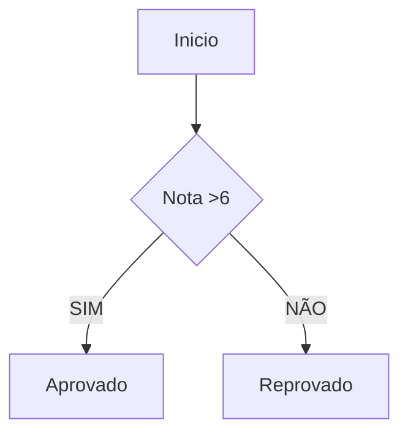
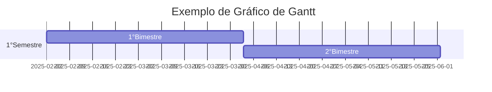

```mermaid
flowchart TD

  A(["Início"])
  A --> B{"Faça uma escolha"}
  B --> C["OP1"]
  B --> D["OP2"]
  B --> E["OP3"]
```

```mermaid
graph TD;
A[Inicio] --> B{Nota >6};
B --> |SIM| C[Aprovado];
B --> |NÃO| D[Reprovado];
```

```mermaid
gantt
title Exemplo de Gráfico de Gantt
dateFormat YYYY-MM-DD
section 1°Semestre
1°Bimestre : a1, 2025-02-02, 60d
2°Bimestre : a2, after a1, 60d

section 2° Bimestre

```

