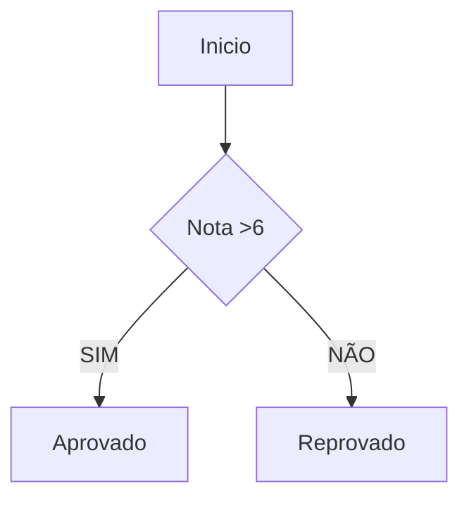
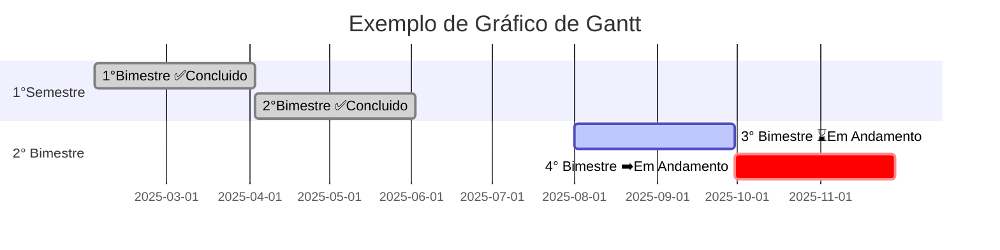
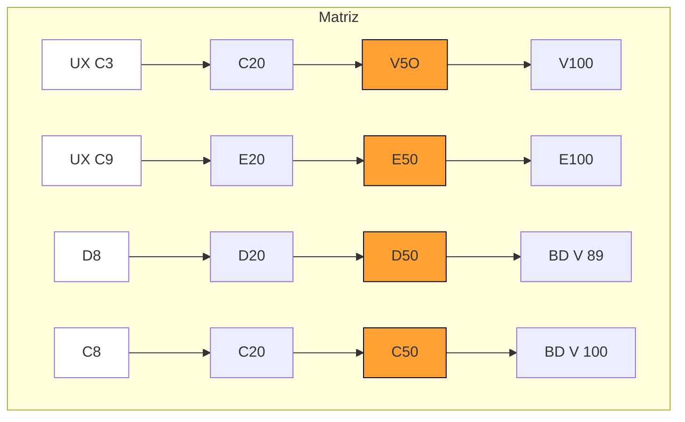
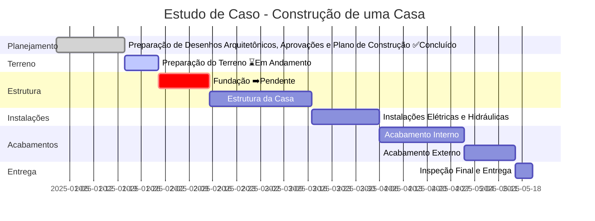

---





<!-- ```mermaid
gantt
title Construção de uma Casa
dateFormat YYYY-MM-DD
section Planejamento
Planejamento e Aprovações ✅:done, a1, 2025-01-01, 20d

section Terreno
Preparação do Terreno ⌛:active, a2, after a1, 10d

section Estrutura
Fundação ➡️:crit, a3, after a2, 15d
Estrutura da Casa :a4, after a3, 30d

section Instalações
Instalações Elétricas e Hidráulicas :a5, after a4, 20d

section Acabamentos
Acabamento Interno :a6, after a5, 25d
Acabamento Externo :a7, after a6, 15d

section Entrega
Inspeção Final e Entrega :a8, after a7, 5d
``` -->


## 📌 Matriz Crystal Clear – Entregas Incrementais

```mermaid
flowchart TD
    A1([Semana 3]) --> B1[Entrega 1: Login com autenticação]
    B1 --> A2([Semana 6])
    A2 --> B2[Entrega 2: CRUD de empresas]
    B2 --> A3([Semana 8])
    A3 --> B3[Entrega 3: Upload de logotipo]
    B3 --> A4([Semana 10])
    A4 --> B4[Entrega 4: Relatórios PDF/Excel]
    B4 --> A5([Semana 12])
    A5 --> B5[Entrega 5: Painel administrativo]
    B5 --> AF([Mês 6])
    AF --> BF[Entrega Final: Sistema completo validado]


