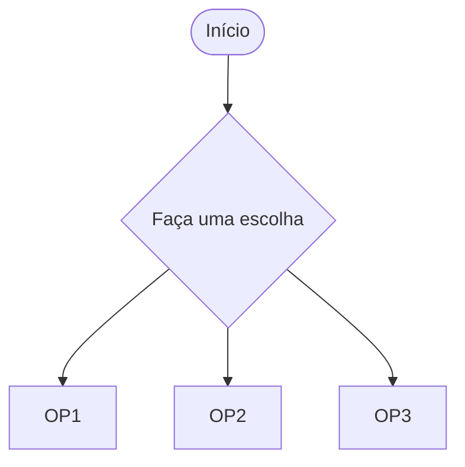
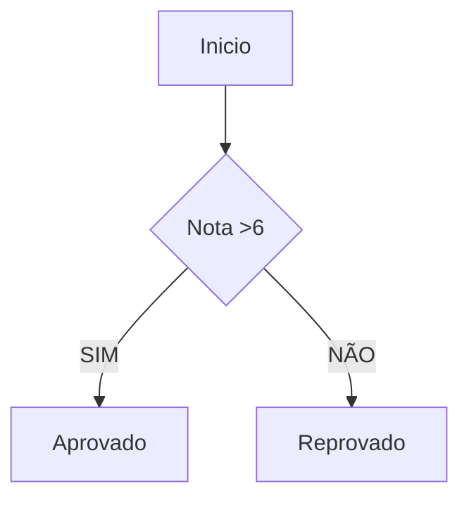
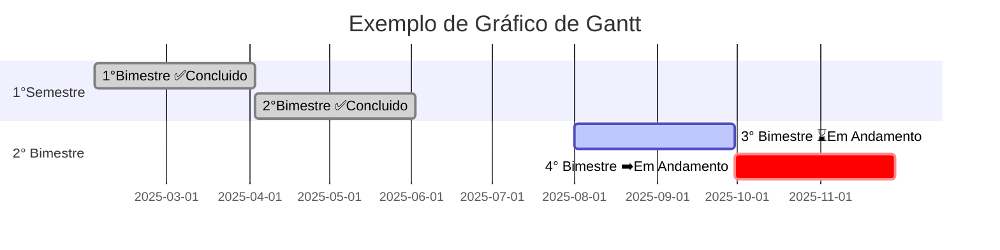
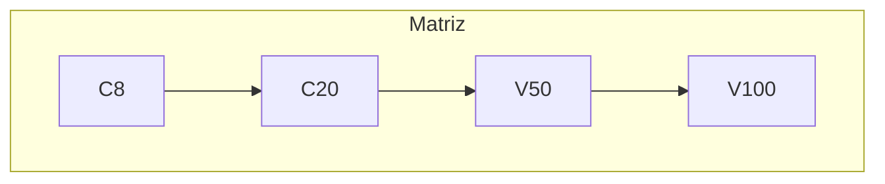

```mermaid
flowchart TD

  A(["Início"])
  A --> B{"Faça uma escolha"}
  B --> C["OP1"]
  B --> D["OP2"]
  B --> E["OP3"]
```

```mermaid
graph TD;
A[Inicio] --> B{Nota >6};
B --> |SIM| C[Aprovado];
B --> |NÃO| D[Reprovado];
```

```mermaid
gantt
title Exemplo de Gráfico de Gantt
dateFormat YYYY-MM-DD
section 1°Semestre
1°Bimestre ✅Concluido: done, a1, 2025-02-02, 60d
2°Bimestre ✅Concluido: done, a2, after a1, 60d

section 2° Bimestre
3° Bimestre ⌛Em Andamento: active, a3, 2025-08-01, 60d
4° Bimestre ➡️Em Andamento: crit, a4, after a3, 60d
```

```mermaid
graph TD
  subgraph Matriz
A1["C8"]:::branco --> A2["C20"]:::amarelo --> A3["V50"]:::laranja --> A4["V100"]:::vermelho

  end
```

