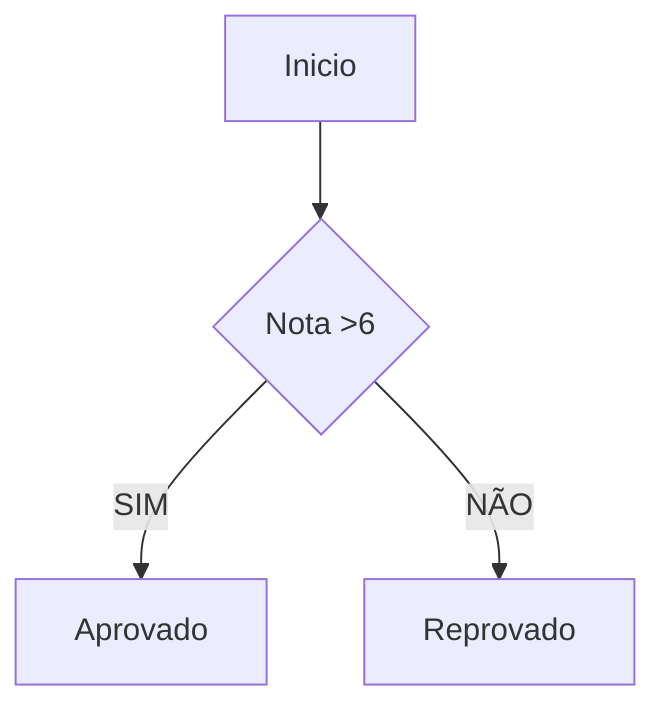
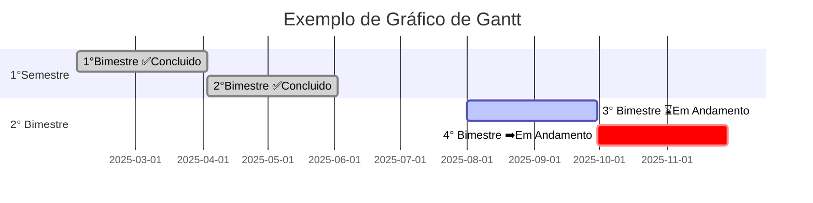
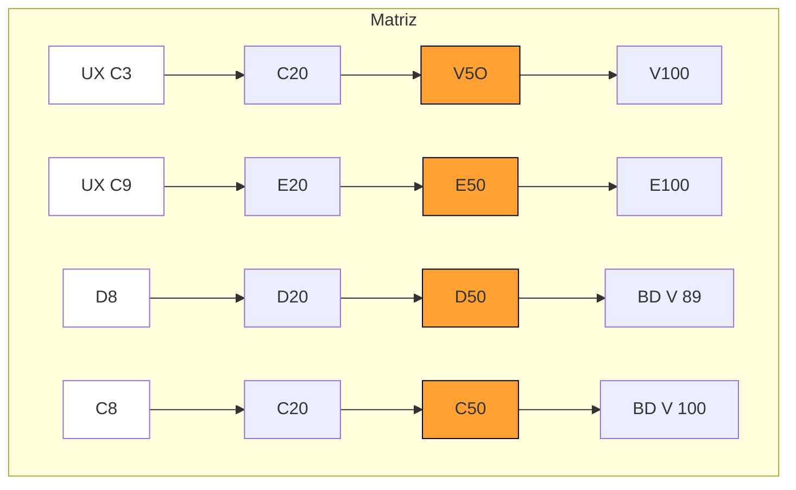
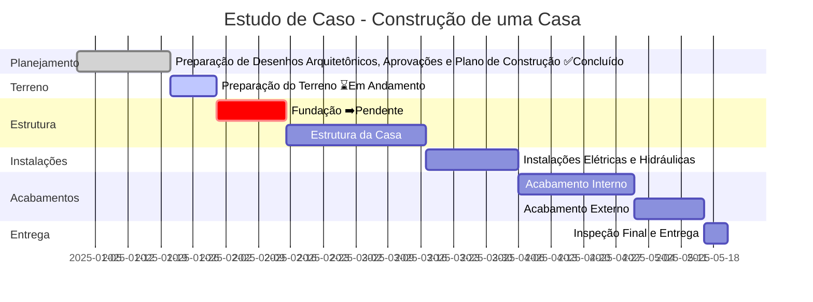

---





<!-- ```mermaid
gantt
title Construção de uma Casa
dateFormat YYYY-MM-DD
section Planejamento
Planejamento e Aprovações ✅:done, a1, 2025-01-01, 20d

section Terreno
Preparação do Terreno ⌛:active, a2, after a1, 10d

section Estrutura
Fundação ➡️:crit, a3, after a2, 15d
Estrutura da Casa :a4, after a3, 30d

section Instalações
Instalações Elétricas e Hidráulicas :a5, after a4, 20d

section Acabamentos
Acabamento Interno :a6, after a5, 25d
Acabamento Externo :a7, after a6, 15d

section Entrega
Inspeção Final e Entrega :a8, after a7, 5d
``` -->

<!-- ```mermaid
gantt
    title Gráfico de Gantt - Sistema de Cadastro de Empresas Parceiras
    dateFormat  YYYY-MM-DD
    axisFormat  %Y-%m-%d
    
    section Pré-Desenvolvimento (Planejamento)
    Levantamento de Requisitos e Documentação :a1, 2025-10-01, 10d
    Elaboração de Rascunhos e Layout UI/UX :a2, after a1, 8d
    
    section Fase de Desenvolvimento I (Entregas 1, 2 e 3)
    Configuração do Ambiente e DB (Setup) :d1, after a2, 5d
    Programação Módulo Login (Entrega 1 - Semana 3) :d2, after d1, 10d
    Programação CRUD de Empresas (Entrega 2 - Semana 6) :d3, after d2, 15d
    Implementação do Upload de Logotipo (Entrega 3 - Semana 8) :d4, after d3, 10d
    
    section Fase de Desenvolvimento II (Entregas 4 e 5)
    Desenvolvimento dos Relatórios (Entrega 4 - Semana 10) :d5, after d4, 10d
    Configuração Painel Admin e Permissões (Entrega 5 - Semana 12) :d6, after d5, 10d

    section Testes e Implantação (Entrega Final - Mês 6)
    Testes Unitários e de Integração (QA) :t1, after d6, 15d
    Testes de Usabilidade com Usuários Convidados :t2, after t1, 10d
    Correções e Ajustes Finais :i1, after t2, 10d
    Implantação Final no Servidor e Entrega ao Cliente (Mês 6) :i2, after i1, 5d
``` -->


